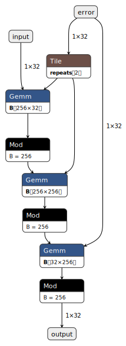

# Tensor-based Proof of Work Design

This document describes a proof of work mechanism based on the Learning with Errors (LWE) problem, implemented using tensor operations.

## Hash Function Structure

The core hash function processes 32-byte inputs through a series of tensor operations:

```
input (32 bytes) → expand (256-d) → 64 rounds → compress (32 bytes)
each round: state = (matrix × state + error) mod 256
```

Parameters:
- Input/Output: 32 bytes
- Hidden dimension: 256
- Rounds: 64 
- Arithmetic: Modulo 256
- Matrix precision: 8-bit integers

### Implementation Phases

1. Expansion Phase (32 → 256):
   ```c
   matrix_multiply(expand_mat, input, state, expand_noise, 
                  HIDDEN, IN_SIZE);
   ```

2. Middle Rounds (256 → 256):
   ```c
   for (uint32_t round = 0; round < ROUNDS; round++) {
       matrix_multiply(middle_mats[round], state, next_state, 
                      middle_noise + (round * HIDDEN),
                      HIDDEN, HIDDEN, impl_type);
   }
   ```

3. Compression Phase (256 → 32):
   ```c
   matrix_multiply(compress_mat, state, output, compress_noise, 
                  IN_SIZE, HIDDEN, impl_type);
   ```

### Error Vector Generation

Error vectors are derived deterministically from the input:
```c
crypto_hash_sha256(digest, input, IN_SIZE);
for (int i = 0; i < total_noise; i++) {
    noise[i] = digest[i % crypto_hash_sha256_BYTES];
}
```

## Hardware Implementation

The algorithm maps to standard tensor operations:
- Matrix multiplication
- 8-bit integer arithmetic
- Dense linear algebra
- Regular memory access patterns

Two reference implementations:
1. `int8`: 8-bit integer matrix multiply
2. `fp32`: 32-bit floating point operations

## ONNX Implementation

Neural network format implementations:
- `tens_hash_fp32.onnx`: FP32 version
- `tens_hash_int8.onnx`: INT8 version 

The computation graph structure can be visualized as follows:



Key aspects of the graph:
1. Input layer: 1×32 dimensions
2. Error vectors: Added at each stage
3. Matrix operations: Gemm nodes
4. Modulo: Applied after each transform
5. Output: Back to 1×32 dimensions

## Research Directions

Open questions:
1. Parameter optimization
   - Hidden dimension size
   - Number of rounds
   - Error distribution

2. Security analysis
   - LWE hardness bounds
   - Memory hardness proofs
   - Attack surface evaluation

3. Implementation optimization
   - Matrix storage formats
   - Error vector generation
   - Hardware-specific tuning

## References

[1] Regev, O. "On Lattices, Learning with Errors, Random Linear Codes, and Cryptography." Journal of the ACM 56, no. 6 (2009).

[2] Lyubashevsky, V., Peikert, C., Regev, O. "On Ideal Lattices and Learning with Errors Over Rings." EUROCRYPT 2010.
